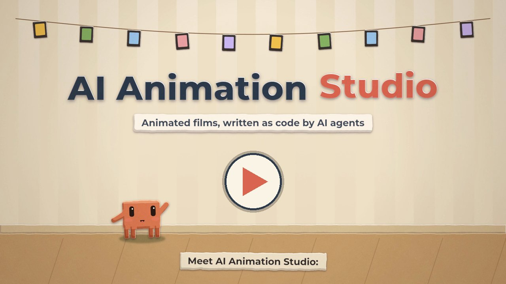

# AI Animation Studio

AI coding agents make animated short films as code. No video models: the agent writes the scene, the engine
renders it frame by frame, and the sound is synthesized from the same events as the picture.

https://github.com/user-attachments/assets/7438de06-bcff-4d28-bf48-592be5efc84e

`ubc25d`, 12 s, with sound: a quick tour of UBC's campus from morning to sunset (the clock tower on Main Mall, the
Irving K. Barber Learning Centre, the Museum of Anthropology, Wreck Beach), built from the reusable scene modules and
shot in 2.5D: the paper layers stand at real distances and the lens swings as Clawd walks, so near layers slide across
far ones. The score and every sound effect are synthesized too.

|  |  |
| --- | --- |
| `showcase`, 12 s: every scene module in a made-up world | `plane25d`, 5 s: Clawd throws a paper plane, shot in 2.5D |

All three films were written by Claude (Opus 5.5) in Claude Code, using the skills and tools in this repository.

## Why code instead of a video model

- **Every frame is exact and editable.** Move a prop, retime a beat, fix a caption, and re-render.
- **Text stays crisp and characters stay on model.** The same frame always renders the same image.
- **Sound stays in sync.** Footsteps, pops and the score are generated from the scene's own events and bars.
- **It runs locally.** A 50 s 1080p film renders in about 1.5–2 minutes on a laptop GPU.

## Quick start

[](https://github.com/BogeLing/ai-animation-studio/releases/download/v0.1.0/ai-animation-studio-tutorial.mp4)

New here? The [two-minute narrated tutorial](https://github.com/BogeLing/ai-animation-studio/releases/download/v0.1.0/ai-animation-studio-tutorial.mp4) (MP4, 23 MB) walks through all of it. It was made with this repository too.

You need Node 24, ffmpeg, and Google Chrome or Chromium (or run `npx playwright-core install chromium`).
[uv](https://docs.astral.sh/uv/) runs the Python tools. A GPU is optional: `--gpu` draws through Mesa's d3d12
driver on WSL2 (measured with an NVIDIA card) and through Metal on a Mac (measured on an M4).

```bash
git clone https://github.com/BogeLing/ai-animation-studio && cd ai-animation-studio/engines/papermotion
corepack enable && pnpm install
pnpm smoke                   # a 1 s test film, rendered two ways and checked (about 20 s)
pnpm render plane            # → out/plane.mp4, with sound
pnpm render:fast showcase --workers 6 --gpu --codec nvenc          # parallel, on the GPU (WSL2 + NVIDIA)
pnpm render:fast showcase --workers 2 --gpu --codec videotoolbox   # the same on a Mac (Metal)
```

Then start Claude Code or Codex in `engines/papermotion/` and ask for a film, for example:

> Make a 20-second paper cut-out film: a lighthouse keeper adopts a seagull. Captions, a lo-fi score, and send me key frames before the full render.

The agent picks up two skills: the engine's skill for writing the scene, and `film-production` for the loop
around it (storyboard, key-frame review rounds, pacing, sound, rendering, checks, delivery). They follow the
open [Agent Skills](https://agentskills.io) format and live in `.agents/skills/`, which Codex reads, with the
same files in `.claude/skills/` for Claude Code.

## What's inside

| Path | What |
| --- | --- |
| [`.agents/skills/film-production/`](.agents/skills/film-production/) | The production workflow as an agent skill (copied to `.claude/skills/` for Claude Code): brief → storyboard → key-frame review → taste decisions side by side → captions, logos and colour → pacing → sound → render → QA → delivery, plus measured cloud-rendering sizing. It doesn't depend on the engine. |
| [`engines/papermotion/`](engines/papermotion/) | The [papermotion](https://github.com/francozanardi/papermotion) paper cut-out engine with its own agent skill, a parallel/GPU renderer, reusable scene modules, sets in 3D with camera scouting, and the films. |
| [`tools/`](tools/) | Engine-independent tools: a pre-delivery video check and a one-frame glitch scan, labelled contact sheets, shrink/mux/compare, WSL2 GPU setup and a probe of what Chrome draws with, and audio analysis for films timed to a recording. |
| [`media/`](media/) | The previews above. |

## Scene modules

Building blocks in [`engines/papermotion/examples/shared/`](engines/papermotion/examples/shared/), each
with TSDoc and an example. The `ubc` and `showcase` films use them all.

| Module | What it gives you |
| --- | --- |
| `captions.ts` | Kraft-paper caption strips, laid down with a small bounce and dropped away as the next one arrives. |
| `title.ts` | A cut-paper title dropping in letter by letter, an accent word, a subtitle card, a lift-away, and landing times for sounds. |
| `walk.ts` | Hop moves between stops with every touchdown listed, and a camera target that travels with the character. |
| `daySky.ts` | A day from morning to sunset: sky, sun, sea and hill colours, blended as the story moves on. |
| `polaroid.ts` | Instant photos whose pictures are drawn once from the set's own props, their flight to a stack and an album, a hand camera and a flash. |
| `lofi.ts` | A warm lo-fi score from a few parameters: electric-piano chords, bass, a half-time beat, a tune and vinyl crackle, laid out in video time. |
| `foley.ts` | Normalised paper-world sound effects: pops, knocks, slides, whooshes, tape, taps, stamps, a bin clank, a shutter, a photo whirr, chimes, birds, gulls and surf. |
| `screen.ts` | A film playing inside another, on a paper TV or a screen: its frames in step with the scene's, and its sound. |
| `narration.ts` | A voice track with the time of every word: boards fill in on the narrator's words and subtitles follow the voice. `tools/voice/narrate.py` voices a script locally with Kokoro-82M, in English or Mandarin. |
| `kit.ts` | Pop-up helpers (one-sheet props, entrances, shapes, cartoon faces) and a clock that fires each sound cue exactly once. |
| `Clawd.ts`, `Plane.ts` | The cast: a paper rig of the Claude Code mascot, and a paper dart that flies along a track. |

## Sets in 3D and camera scouting

A set can also be built in 3D and filmed through a perspective camera, still drawn as torn paper: `Diorama`
places paper faces, pop-up cards and 2D rigs in the world, `shot` describes a camera the way a director would
(size, bearing, elevation, where the subject sits), and `CameraPath` moves through shots. Before rendering, the
agent scouts: `pnpm scout` draws a moment from several shot setups side by side with numbers that judge each
(how much of the subject is seen, its size, clutter near the lens), then checks the whole camera move frame by
frame. The `diorama` film (8 s, a paper village) was made this way; `diorama_three` is the same film drawn by a
second renderer on three.js, with true occlusion and the sun's shadows on every surface.

Any 2D film here can also be re-shot in 2.5D: `DepthCamera` films its parallax layers as sheets standing at real
distances and swings the lens round the action, so near layers slide across far ones. `plane25d` and `ubc25d` are the
`plane` and `ubc` films shot that way; only the camera changes.

```bash
pnpm scout diorama 3.4      # nine shot setups of one moment → out/scout/diorama_3.4s/sheet.jpg
pnpm scout diorama --path   # the film's camera move, frame by frame, with a preview video
```

## Rendering speed

Measured on a laptop with an RTX 3060 (6 GB) under WSL2 with 12 GB of RAM, at 1920×1080 and 30 fps:

| Film | Setup | Time |
| --- | --- | --- |
| `smoke`, 30 frames | `pnpm smoke` (both renderers, then the checks) | about 20 s |
| `showcase`, 360 frames | `render:fast --workers 6 --gpu --codec nvenc` | 40 s (31 s drawing) |
| a 50 s film, 1498 frames | 6 GPU workers | about 90 s (60 ms a frame) |
| any film | one CPU page | 1.2–1.4 s a frame |

More GPU workers stop helping once the card's memory fills (each takes about 0.4 GB).

On a MacBook Air with an Apple M4 (10-core GPU, 24 GB), where `--gpu` draws through Metal:

| Film | Setup | Time |
| --- | --- | --- |
| `smoke`, 30 frames | `pnpm smoke` | about 12 s |
| `showcase`, 360 frames | `render:fast --workers 2 --gpu --codec videotoolbox` | 29 s (24 s drawing) |
| `showcase`, 360 frames | `render:fast --workers 2 --gpu --codec webcodecs` (encoded in the page) | 27 s |
| `diorama`, 240 frames | the same two ways | 8.6 s and 6.2 s |
| `showcase`, 360 frames | `render:fast --workers 8` (CPU, x264) | 54 s (36 s drawing) |
| `showcase` | one CPU page | about 0.4 s a frame |

Two Metal workers are the sweet spot there (one: 99 ms a frame; two: 70; four: 73; six: 78). Chrome on macOS
draws on the GPU even without `--gpu`, so the CPU path passes `--disable-gpu`.

GPU frames aren't bit-exact and, rarely, one comes out with a garbage block, so always run
`tools/video/check_video.sh` on a GPU render; CPU renders are bit-exact.
[`cloud.md`](.agents/skills/film-production/references/cloud.md) has measured numbers for rendering on Lambda,
Cloud Run and Modal.

## Engines

- **papermotion** (paper cut-out): included.
- More styles may follow, such as a hand-painted one. An engine goes in `engines/<name>/` with its own agent
  skill; if its renderer leaves frames in `out/frames/<film>/` and writes an MP4 with sound, everything in
  `tools/` and the `film-production` workflow applies unchanged.

## Credits and licenses

- This repository: MIT © 2026 Boge Ling ([`LICENSE`](LICENSE)).
- The papermotion engine: MIT © 2026 Franco Zanardi ([`engines/papermotion/LICENSE`](engines/papermotion/LICENSE)).
  `src/` is upstream's engine plus a `seek` hook for parallel rendering and the 3D modules (camera, shots,
  dioramas and scouting hooks).
- The tutorial's narration is a synthetic voice, generated with [Kokoro-82M](https://huggingface.co/hexgrad/Kokoro-82M) (Apache-2.0).
- Montserrat: SIL Open Font License 1.1 ([`OFL-Montserrat.txt`](engines/papermotion/public/fonts/OFL-Montserrat.txt)).
- Clawd is the Claude Code mascot by Anthropic, drawn here as fan art. This project is not affiliated with
  or endorsed by Anthropic.
